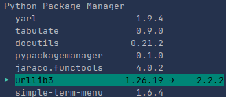

# PIP Package Manager

A command-line interface (CLI) tool for managing Python packages.




## Features

- List installed packages
- Upgrade packages
- Downgrade packages to specific versions
- Uninstall packages
- Interactive menu interface
- Package search


## Installation

1. Clone this repository:
```
git clone https://github.com/Paulius11/pip_package_manager.git
cd pip_package_manager
```

2. Install the required dependencies:
```bash
pip install -r requirements.txt
```

## Usage

Run the script using Python:

```bash
python main.py
```


Use the arrow keys to navigate the menu and Enter to select an option.

## Contributing

Contributions are welcome! Please feel free to submit a Pull Request.

## License

This project is licensed under the MIT License - see the [LICENSE](LICENSE) file for details.